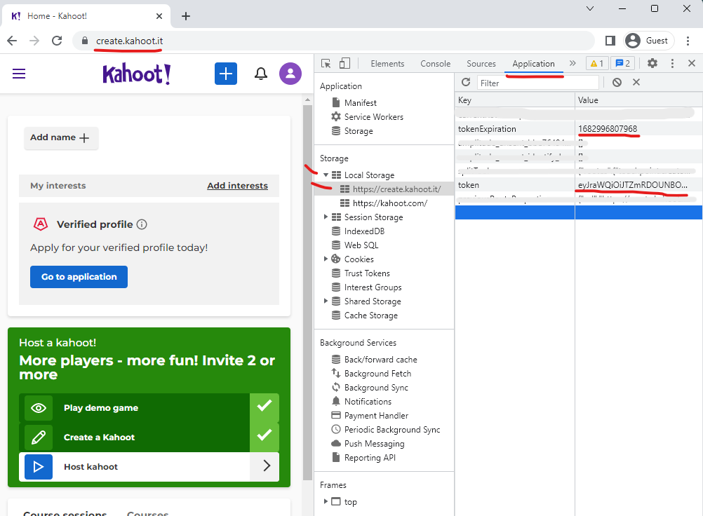

# HvaKostrN
A kahoot quiz generator based on DBA listings.

HvaKostrN is a small project that scrapes DBA (den blå avis) for random listings. These listing are then converted into questions consisting of four different prices with one of these being the original and the correct answer. The program then takes the downloaded DBA listings, converts them into a quiz and uploads it up to kahoot and creates the quiz.<br><br>

The project essentially consists of two sub parts:
- DBA Kahoot quiz maker
- Automatic quiz and images upload

<br>

*(ensure auth.json has been configured and requirements.txt have been installed before running)*


## HvaKostrN
[Ensure project is properly setup through "Setup" section](README.md#setup)

The two files for "creation of the quiz" and "the upload of it to kahoot" can be run seperately or in extension of each other. <br>
Below is how to run everything at once from one file and the recommended way to run the program
<br>
<br>
There are three arguments that can be passed to the program. *(all of these can be left blank)*

```
--amount            amount of questions below 35
--name              name of the quiz
--openbrowser       whether to open a window after the program is done with the quiz or not, default false
```


Here is an example that creates a quiz with 17 questions with the name "MyFirstHvaKostrN". And it will upload the quiz to kahoot.it and open a browser where you can test the quiz afterwards.
```
py HvaKostrN.py --amount 17 --name MyFirstHvaKostrN --openbrowser True
```

<br>

## DBA Kahoot quiz maker
[Ensure project is properly setup through "Setup" section](README.md#setup)

To run DBA kahoot quiz maker, use the following command from the root of the project. Or run the python file whatever way you wish.
```
py DbaKahootQuizMaker.py 
```
You'll be asked how many questions you want and the program will generate the quiz with a random name
<br>
<br>
It's also possible to add arguments to define name and total questions directly
```
py DbaKahootQuizMaker.py 20 "myFirstQuiz"
```

<br>

## Automatic Image upload
[Ensure auth.json file is configured](README.md#automatic-quiz-and-image-upload-setup)

Then you can run the "quiz and image upload program" with this command *(example path)*
```
py uploadimagesToKahoot.py "C:\HvaKostrN\ExportedQuizzes\hvadkoster1234"
```
The program will log in on your behalf and create a new quiz from the data provided.
<br>
<br>

# setup
### **Requirements**
- Python Installed
<br>

Recommended setup is to crate a virtual environment on the project folder. It can be done with the following command
```
py -m venv "path to directory fx: C:\Projects\HvaKostrN"
```

Then afterwards install requirements.txt. <br>
```
pip install -r requirements.txt
```

<br>

## Automatic quiz and image upload setup  
To run the automatic upload of the quiz ensure that playwright is installed.

Afterwards login to https://create.kahoot.it/ and get your "token" and "tokenexpiration" from the developer tools, "f12", to update your **auth.json** file. 
<br>



Then insert the values in **auth.json**

```
{
  "origins": [
    {
      "origin": "https://create.kahoot.it",
      "localStorage": [
        {
          "name": "tokenExpiration",
          "value": "INSERT EXPIRATION HERE"
        },
        {
          "name": "token",
          "value": "INSERT TOKEN HERE"
        }
      ]
    }
  ]
}
```

<br>

# Notes

- The KahootQuizTemplate file is used in the generating of quizes so avoid deleting this, or any other files for that matter


**List of other commands to play around with the project** <br>
A small list of commands if one wanted to play around with the project
```
playwright codegen https://create.kahoot.it/ --save-storage=auth.json
npx playwright codegen https://create.kahoot.it/ --save-storage=auth.json
playwright codegen --load-storage=auth.json https://create.kahoot.it/creator
```